+++

date = '2025-09-02T10:28:32+08:00'

draft = false

title = '深入分析 SmokeLoader'

tags = ['malware','loader']

categories = ['Analyze']

+++


SmokeLoader一款恶意软件加载器，同时也可作为僵尸网络。在本文中，我们将了解 Smoke Loader 如何解压自身并与 C2 服务器交互。smokeloader有很多版本，当前分析的版本是2020的。

 Smoke Loader 于 2011 年 6 月首次亮相，被很多恶意软件当做下载器，去下载加载其他恶意软件，同时smokeloader也有很多插件来丰富自身，如窃取信息，DDOS攻击，FakeDns等。

样本流程图如下：

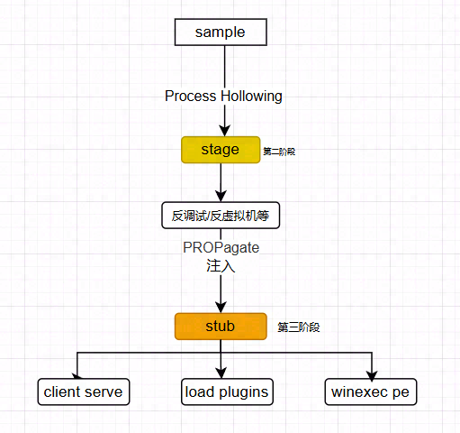


##  第一阶段

### 解密shellcode

一般分析shellcode可以在virtualalloc和localalloc这种内存申请的敏感api下断点。
在LocalAlloc下断点

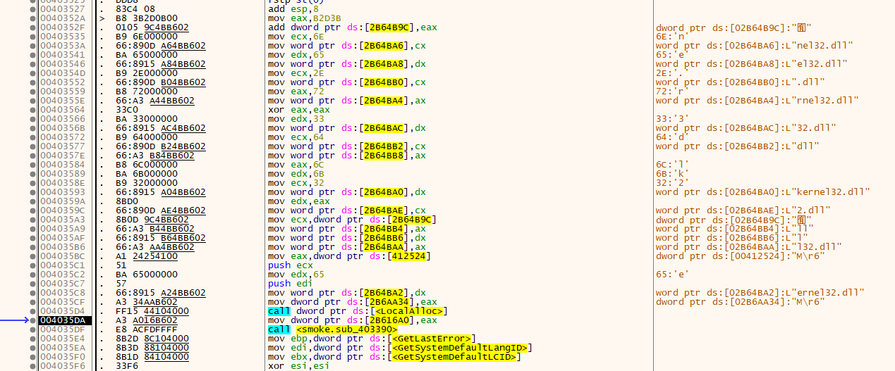

对内存区域中的某些字节进行解密，将shellcode复制到申请的内存中。

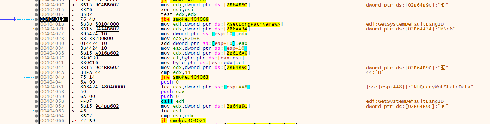

call eax (eax -> 02c90efd)，运行shellcode

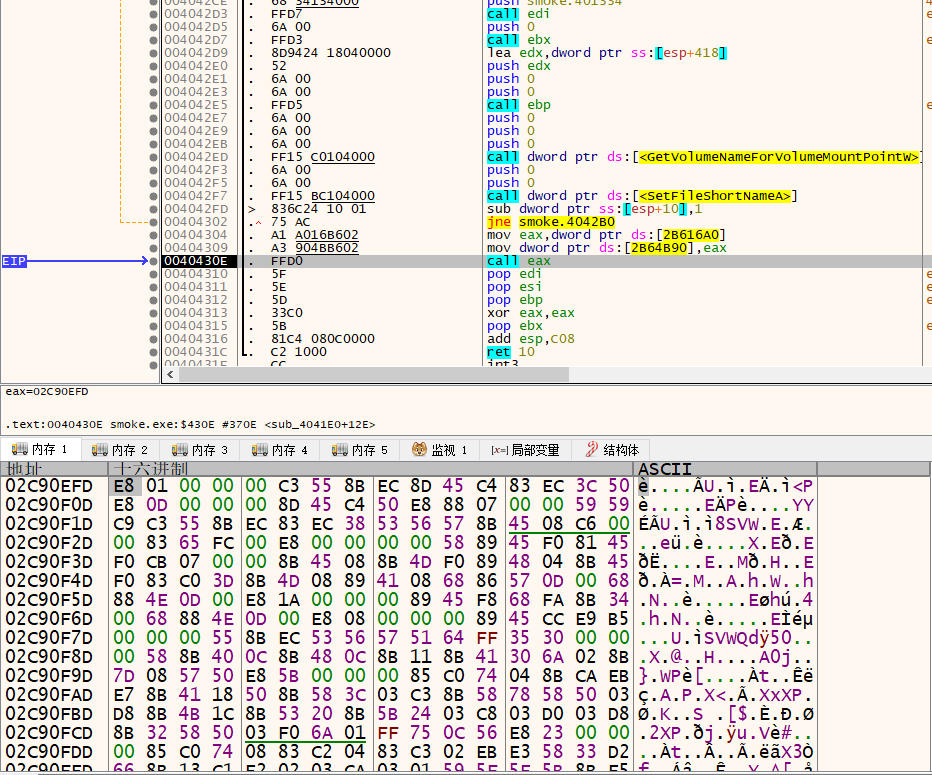

进入查看，是smokeloader中第一阶段的第一个shellcode


### 动态获取API

在ida中进行分析，首先动态获取api

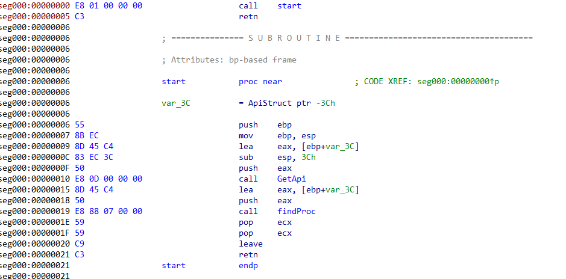


获取LoadLibrary和GetProcAddress函数的地址

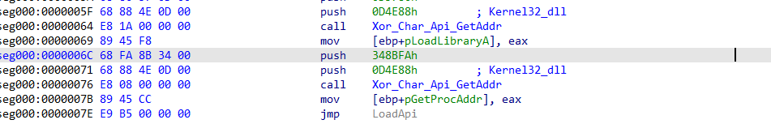


在32位系统，在TEB中偏移为0x30获取PEB结构的地址，在PEB中偏移0x18处得到PEB_LDR_DATA(ldr)结构的地址，ldr中存储了与模块有关的信息，在ldr结构有三个双链表，第一个LIST_ENTRY(*InLoadOrderLinks*)存储了需要加载的模块表，比如ntdll，dll，kernel32.dll，在这里Windows把他命名为LIST_ENTRY，实际上双链表中的存储的结构为LDR_DATA_TABLE_ENTRY，这个结构存储了模块信息，如模块基地址，模块名字等。

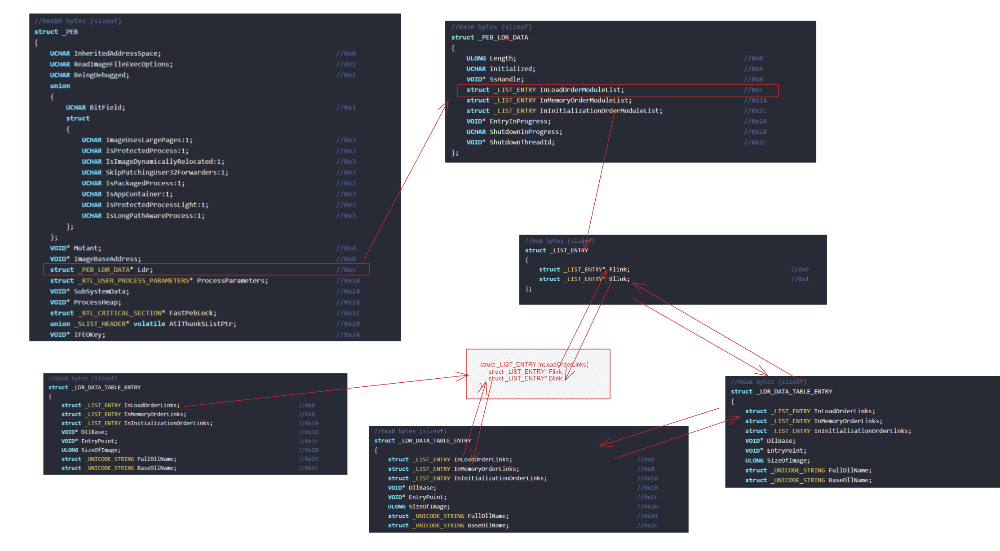

获取这些结构中的数据，可以很容易获取kernel32的地址，然后解析kernel32中导出表的地址，可以获取所需api的地址。简单的可以表示为这样

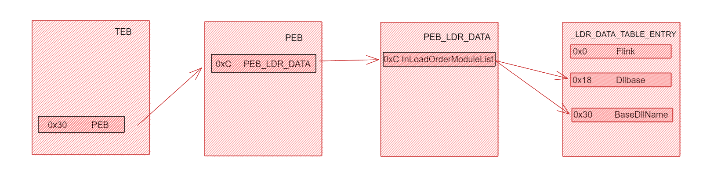

获取kernel32的基地址后，解析kernel32的PE结构，在kernel32的导出表中寻找所需的API，

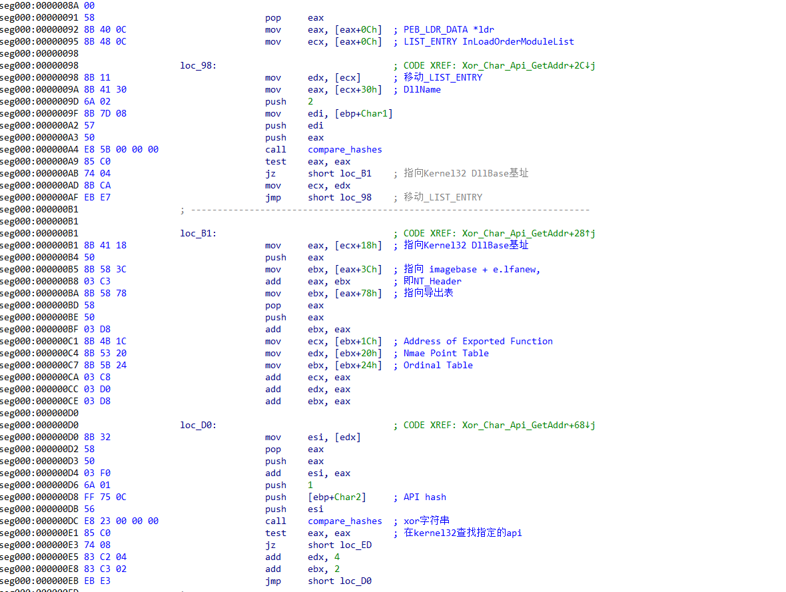


跳转新的code地址

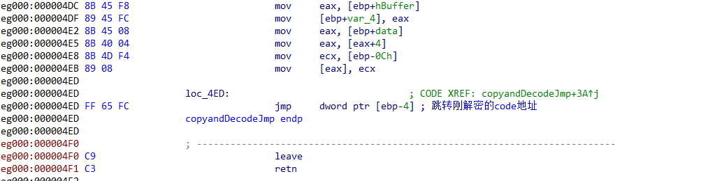


在其VitualAlloc中下断点，就是下一阶段shellcode

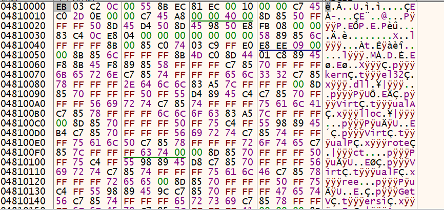


在这里 ebp - 4 间接寻址到vritualAlloc申请的地址，在x32dbg中申请的地址为4820000，这是第一阶段的第二个shellcode


下一阶段的API 获取

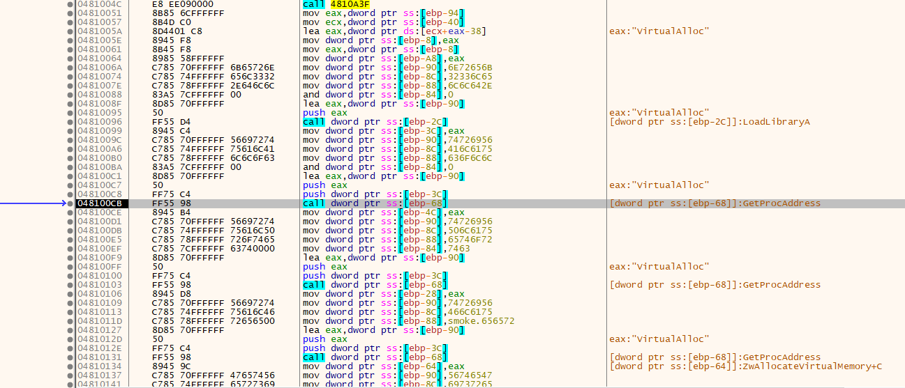

在virtualalloc中申请的地址中，获取到了最终的exe文件

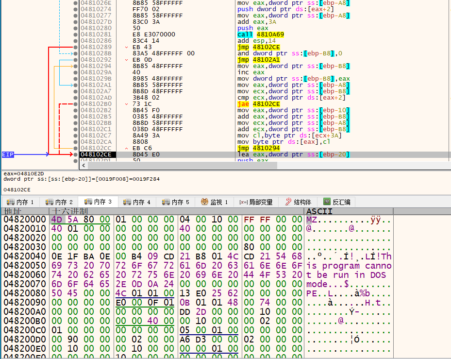

### 傀儡进程注入

smokeloader在这一阶段使用**Process Hollowing**技术，将其自身的image给清空，然后将解密出来的可执行文件“展开”写入到原来地址中，然后call 入口点函数。

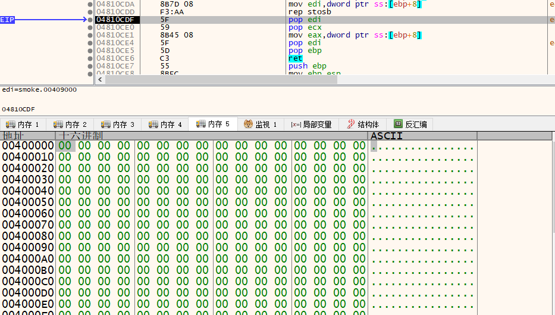

这里是对新复制的可执行文件，使用常用的LoadLibraryA和GetProcAddress加载所需的dll

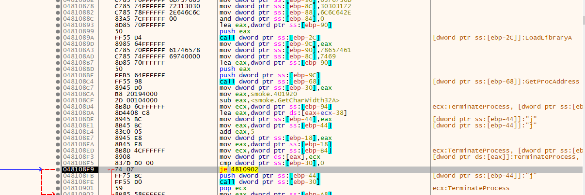

跳转到新的入口点

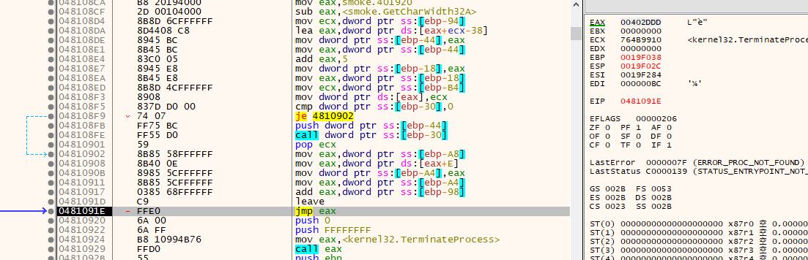

这里就是新的入口点，此时就可以将其dump下来


dump下来的程序是用Fasm编译的

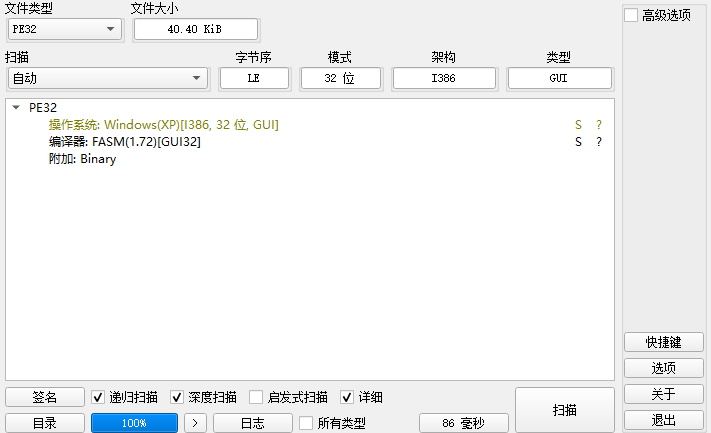


## 第二阶段


### 代码混淆

在第二阶段中使用了跳转混淆，恶意代码对抗反汇编的常用技术是使用指向同一地址使用两个连续跳转指令，可以阻碍静态分析。比如这的jnz loc_403236 和 jz short loc_403236，都是跳转到403236这个地址。jnz和jz这两个跳转联合在一起在效果上其实就是jmp跳转，在这里即**jmp short loc_403236**。但在反汇编中可以看到这里反汇编了下一条指令jle short loc_4031C4。这条指令永远不会执行，在这单纯就是来对抗反汇编的。

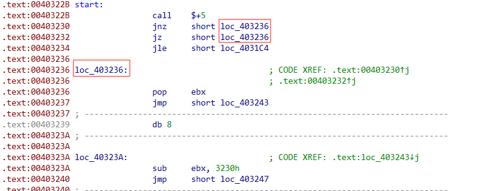

可以使用python去除pe中的混淆

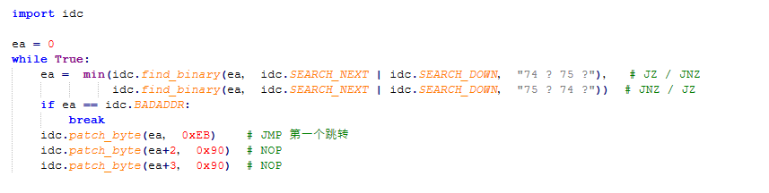


进行patch以后的


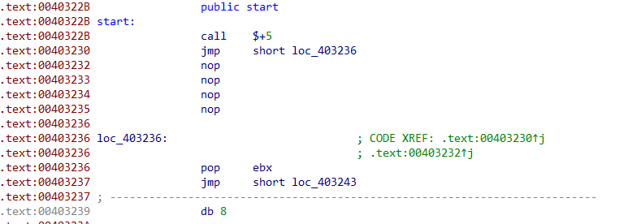

在经过简易的修改可以得到被反混淆以前的

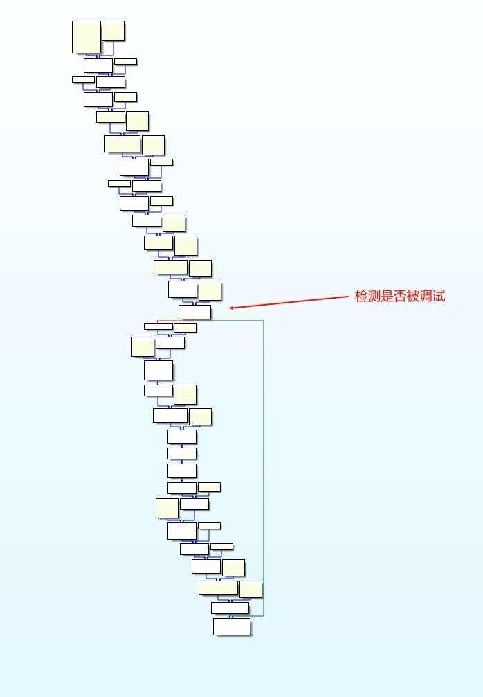


通过赋值和修改寄存器值来修改程序运行的地址。使用了push寄存器和ret的组合，将需要跳转的地址存储在堆栈中，函数在结束时会平衡堆栈，这样就可以间接跳转到下一次运行的地址。

将 31cd 入栈

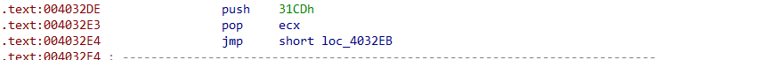

检查是否在调试，eax为PEB的地址，eax+2则为BeingDebugged。如果在调试中，此时的ecx会因为在调试中变为1，然后下面的add，又将其加一

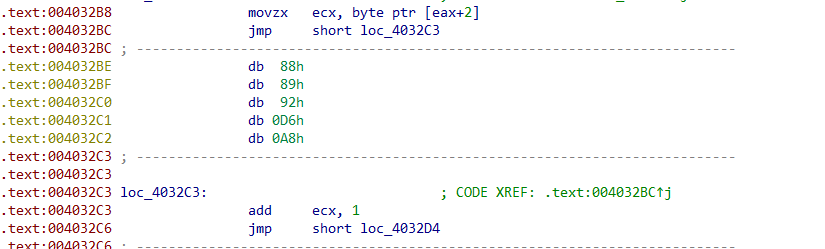


他会将当前需要跳转的地址进行乘以ecx，此时的ecx因为在调试已经变为了2，ecx*31CD就是下次运行将要跳转的地址，则得到的结果会间接跳转到无法运行的地址`0x0040639A`.

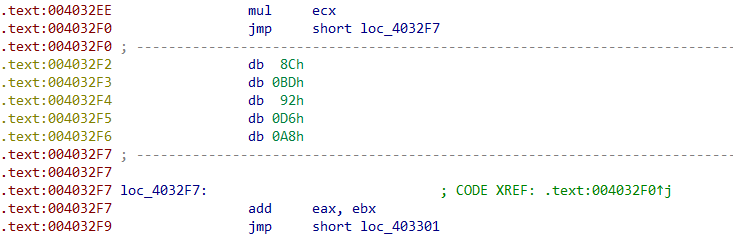

如果没在调试中，ecx = 1， eax 将得到地址 **`eax -> 4031CD`** ;

这里push 和 ret 组合起来就是下次运行的地址，即 4031CD，原因是因为将eax(0x4031CD)入栈，而ret因为函数结束，cpu会平衡堆栈，会将栈中保存的信息给出栈，此时**push+ret**修改了函数的返回地址。所以EIP寄存器得到了被弹出的eax(0x4031CD)地址。

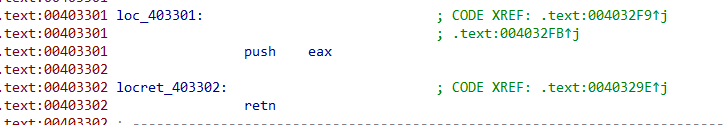

反汇编这个函数，会检查OSMajroVersion是否大于6(windows系统在windows vista以上)，不是会直接跳转到一个无法运行的地址，调试会报读取异常(跳转运行的内存属性不是RWX)而直接退出，让你无法进行调试。检测PEB中的BeingDebugged(PEB+2)中的值是否被调试，PEB中这个成员一般为0，为1表示程序被调试中。如果被调试，此时寄存器读取后ecx = 1，反之，则ecx = 0，这样就修改了寄存器值，进而影响接下来的程序运行。

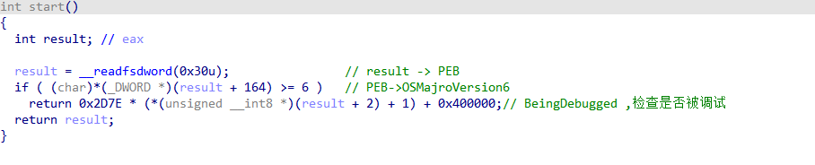


在x32dbg中

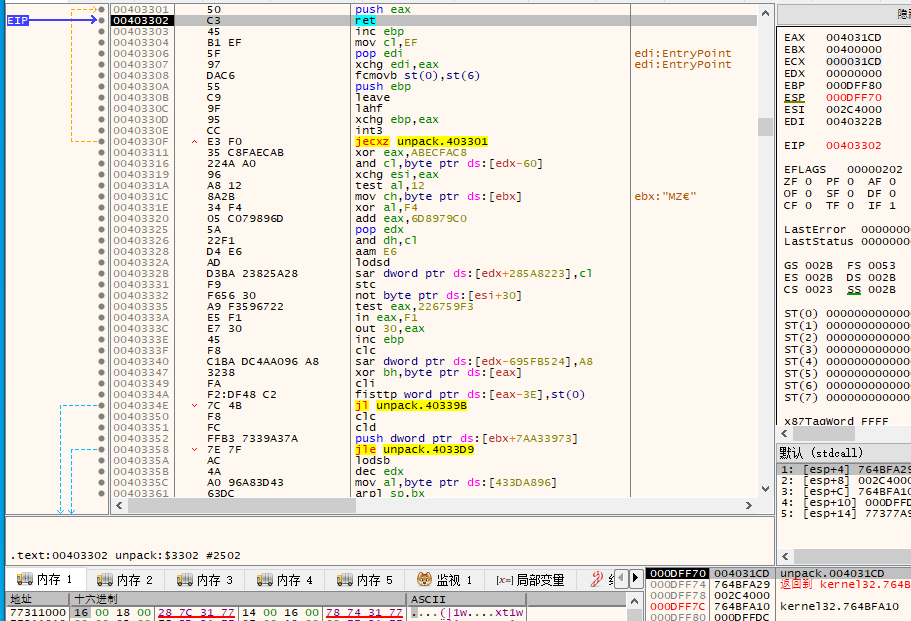


跳转到下一个函数

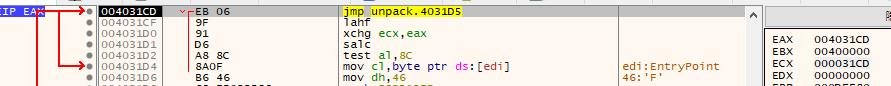

这里还会检查PEB中的成员NtGlobalFlag，同样进行判断是否被调试，同样的进行push修改后的地址，进行跳转

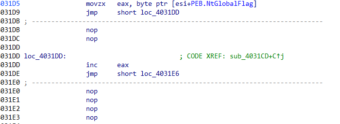


使用xor对某些字节进行异或操作，在运行时对某些字节进行解密，运行完成后会再次加密这些字节，以达到即用即解密，使内存中被被解密的内容更少，让反病毒软件更难匹配恶意软件的特征码。

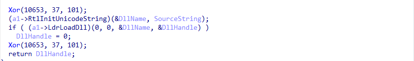

这里是对给定的内存中解密数据的。

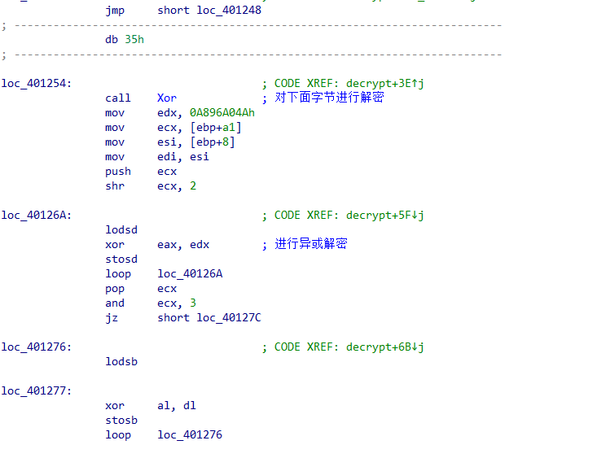


smc 自修改的解密函数

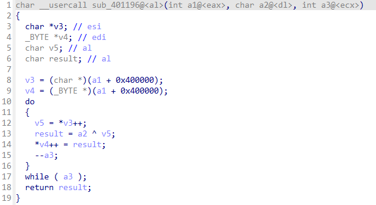


这些函数本体都被加密了，需要解密执行，执行又会被加密回去

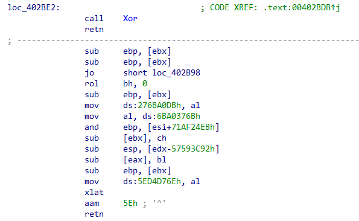


调用此函数的数目很多

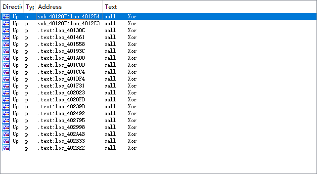

使用idapython进行解密

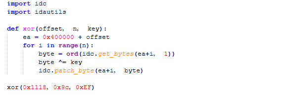

解密后的数据


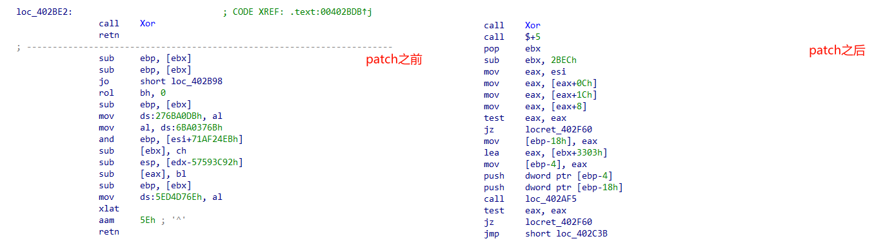

### 获取API

动态获取ntdll中所需的api，同样是通过PEB来动态获取API

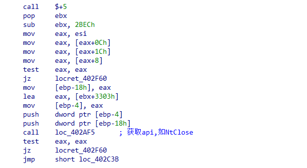

使用LdrLoadDll加载这几个dll模块，获取加载模块的基址。

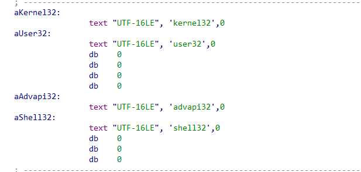

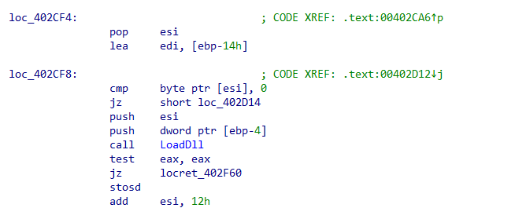

需要解密被加密的api hash，该api hash使用了djb2算法

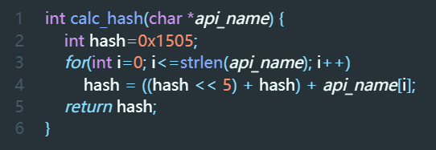

解密后的api hash

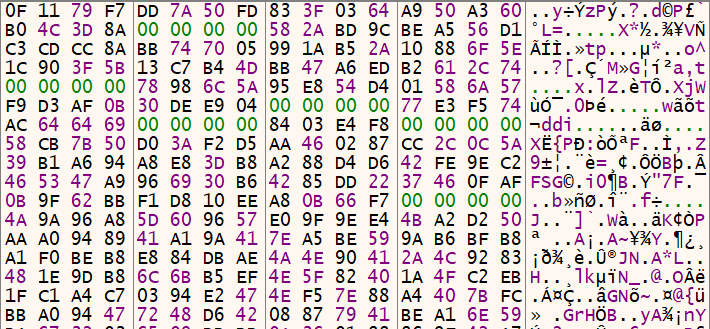


根据解密后的hash去获取api地址


部分计算出来的api hash

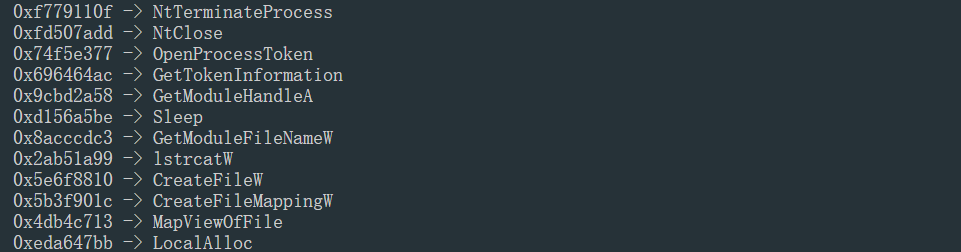


### 跳过感染

使用NtUserGetKeyboardLayoutList获取键盘语言布局，以判断跳过不需要运行的国家

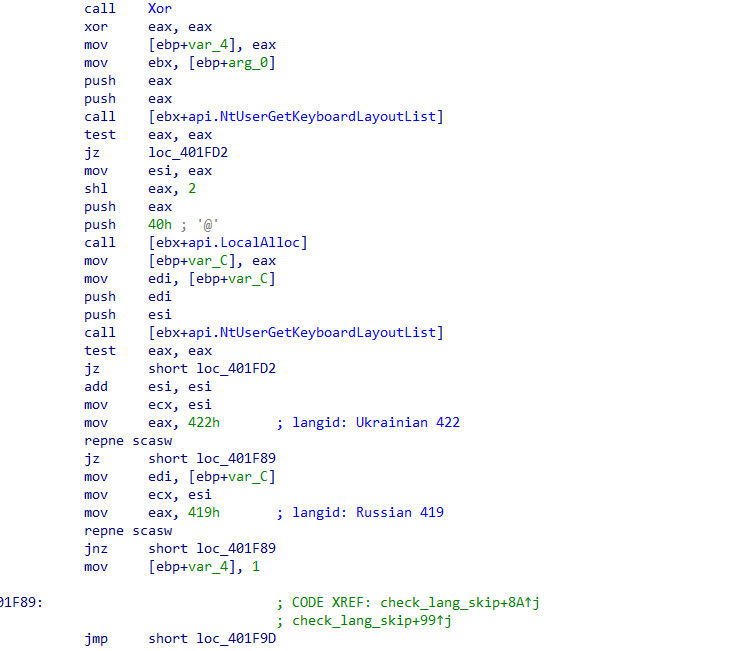


### 反调试

使用ZwQueryInformationProcess，来判断**PROCESSINFOCLASS** 枚举中的**ProcessDebugPort =7**，该值是进程的调试器的端口号。非零值表示该进程在3环被调试器调试。如果检测到正在被调试，将终止进程。

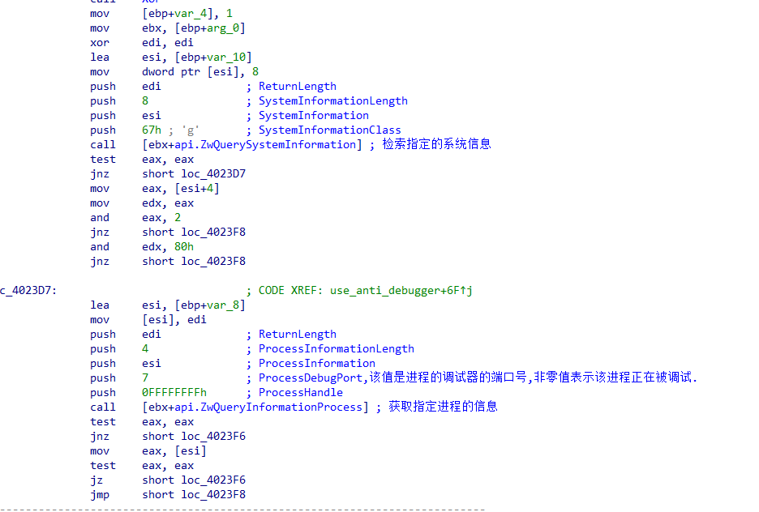

主要使用的几种反调试方法

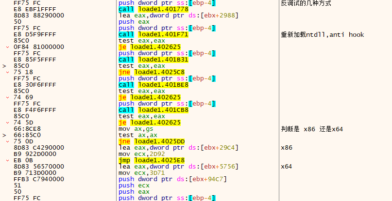


### 检查权限

使用OpenProcessToke API获取进程令牌，获取TokenIntegrityLevel字段，如果小于0x2000，表示软件的完整性级别较低


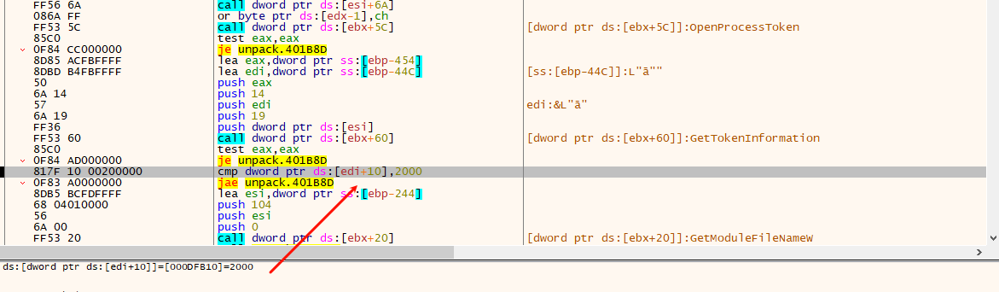

使用GetTokenInformation查询到的完整性，如果是正常用户会等于2000，如果是以管理员运行程序，会是3000。如果完整性低于0x2000，将使用ShellExecuteExW执行，使用cmd运行wmic接口再次运行恶意软件。程序完整性低，将无法注入程序，功能会被限制。

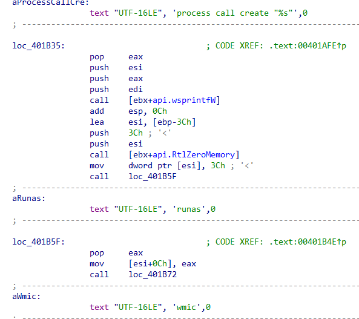

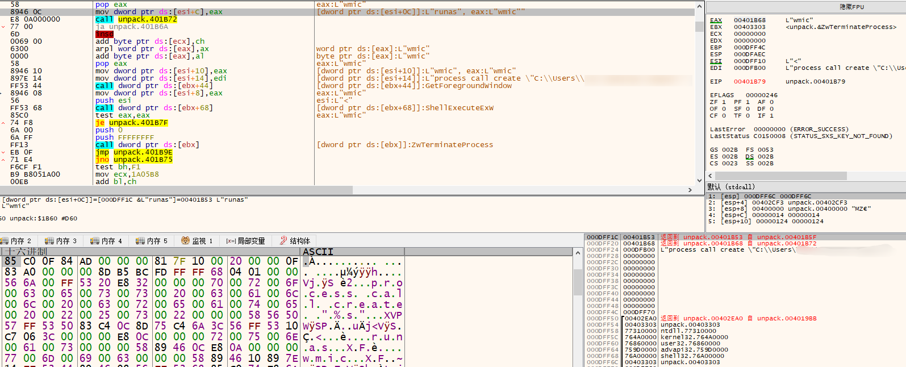


### 反hook

复制ntdll.dll到临时目录中，并给定的随机名字，读取并映射ntdll文件，然后解析获取ntdll导出表中所需的api。可以针对反病毒软件对这些敏感api的监控。

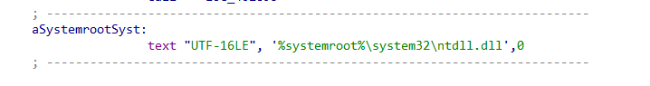

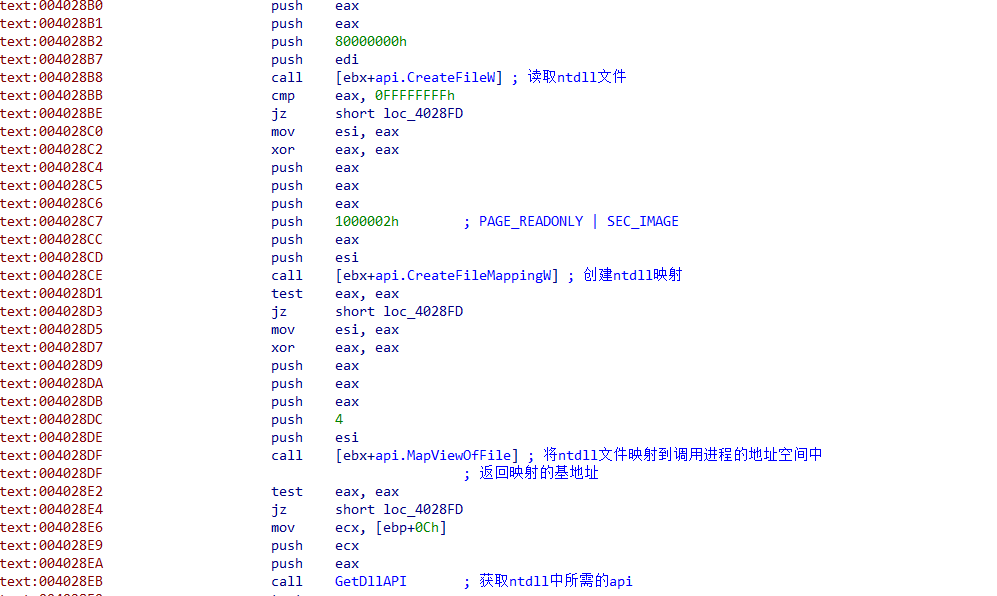

使用CreateFileW读取ntdll文件，然后使用MapviewOfFile映射到内存中


返回映射ntdll的地址，最后解析api


从ntdll中获取的api


### 反沙盒和反虚拟机

下一个检查是检测模拟器，检查可执行文件的路径是否包含字符串 `[A-F0-9]{4}.vmt`。使用 wcsstr  查找当前进程的文件路径中是否有72A0.vmt。 


查看当前模块中是否有**sbiedll**，**aswhoo**，**snxhk**这三个模块。sbiedll.dll是sandboxie 沙盒运行的模块文件，aswhook和snxhk是其他沙盒运行所需的文件


查找给定的注册表路径，来实现反虚拟机检查


它使用 NtOpenKey 打开注册表项 **`SYSTEM\CurrentControlSet\Enum\IDE`** 和 **`SYSTEM\CurrentControlSet\Services\Disk\Enum\SCSI`**，并使用 NtQueryKey 获取其子项的数量和大小


它使用 NtEnumerateKey 获取有关子项的信息，并检查此注册表子项中是否包含字符串 **qemu、virtio、vmware、vbox、xen** 。这些字符串与虚拟机相关。


检查虚拟化环境。Smokeloader 调用 `NtQuerySystemInformation` 来获取所有正在运行的进程


检查它是否包含以下字符串，若有则退出


检查加载的驱动程序中是否存在虚拟机相关的字符


### 解压注入shellcode

恶意软件首先通过查看 GS 寄存器来检查它是否在 64 位或 32 位系统上运行，因为 GS 在 Win64 中为非零，而在“真正的”32 位 Windows 中，GS 始终为零。如果它运行在 64 位系统上，它使用 Heaven’s Gate 技术。Heaven's Gate是一种用于从 32 位进程运行 64 位代码的技术。

通过判断cs寄存器值来解压32位或者64位dll


解压dll，解压失败则退出


使用lzsa算法来解压


 使用LZSA2压缩算法解压shellcode，这里是算法的部分汇编代码


使用该算法解压后可以得到这是个dll


#### DLL


这个dll在被解压之前，是被加密的，需要先进行解密


解密后的x86区域地址内容


x86可执行文件

lzsa解压算法解压得到32位dll，该dll的部分pe头部信息被清理了，需要自行修补


x64可执行文件

解密后的x64区域地址内容


Lzsa解压的x64可执行文件


注入到explorer中

这个样本通过调用GetShellWindow来获取shell窗口的句柄，然后调用GetWindowThreadProcessId来获取explorer.exe的进程ID，避免使用快照迭代获取进程。使用ZwOpenProcess打开explorer进程，获取一个操控explorer的句柄，在当前进程和任务管理器中创建共享内存，loader使用ZwCreateSection和ZwMapViewOfSection映射dll节表到任务管理器中，在映射到explorer之前，先映射到当前进程，当前进程的更改会同步到explore中，然后再用RtlCreateUserThread创建远线程运行dll。

API调用链

> GetShellWindow -> GetWindowThreadProcessId -> NtOpenProcess -> NtCreateSection -> NtMapViewOfSection x2-> RtlCreateUserThread


如果是x32，获取x32入口点，加载所需的dll，然后使用RtlCreateUserThread创建远线程注入解压的dll到explorer中。

如果是x64，使用Heaven’s Gate获取x64的RtlCreateUserThread，同样远线程注入explorer中。


### Heaven’s Gate修复使用

这里进行修改让Smokeloader 解压缩 32 位有效载荷。Smokeloader 在 `explorer.exe` 中利用 Propagate 技术注入有效载荷，在 2020 版本中仍然注入到此进程中，但使用 `NtCreateSection`、`NtMapViewOfSection` 和 `RtlCreateUserThread` 的组合来开始执行。

 CS寄存器

在 x86 架构中，CS（代码段）寄存器保存代码段的段选择器。

> cs 寄存器值：对于 x86 ：0x23，对于 x64 ：0x33

这里通过远跳转call far(跳转不提权)来进行cs段的切换，cs段的切换可以使天堂之门可以在x32和x64之间转换，原本在x32(cs:0x23)的环境下通过远跳转cs寄存器被修改为x64环境(cs:0x33)，可以构造x64函数进行调用。具体的实现可以看这个[天堂之门 (Heaven's Gate) C语言实现](https://bbs.kanxue.com/thread-270153.htm)


x64使用gs:[60]来获取peb.


获取api


创建远线程注入


在RtlCreateUserThread(x86)下断点得到可执行文件


为了节约时间，修改了汇编代码，让其在x64中可以运行，可在explorer的内存中，可以找到被映射的x32文件。


x64也是一样的，只不过是在天堂之门的情况下，从32转换为64位，在explorer中同样找到了


dll的提取也可以使用unicorn进行模拟执行来获取。在dump第一阶段后，使用unicorn从入口点开始进行模拟，设置堆栈，映射文件到unicorn内存中，unicorn映射PEB结构，映射ntdll，kernel32等dll，模拟部分Windwos Api，对于反调试的，可以取巧设置unicorn的寄存器直接跳过，跳转到解压dll的函数地址。对于解压没有使用windows api，unicorn对于这种可以直接模拟的。


## 第三阶段


由于dump下来的已经被去除了pe的部分信息，需要重建pe头部信息才能运行。这是修复后的


### 获取api

使用ROL8 hash算法计算出ntdll和kernel32的hash，然后从peb中获取当前可执行文件中的 **ntdll(0xBC26C15E)** 和 **kernel32(0x8FDF69C6)** 计算出的hash分别进行比较获取其基地址。然后使用obje2 hash算计算windows api name的hash进行动态解析导出表获取api地址, 也可以获取GetProcAddress和LoadLibraryA，有了这两个api，我们可以加载任意dll，获取所需api的地址。


解密函数，使用rc4加密算法用来解密url，字符串


rc4算法


### 反调试

通过创建两个线程来反调试


一个用来检查进程，使用CreateToolhelp32Snapshot枚举进程，然后使用obje2对运行的程序名进行hash计算，与保存的hash进行比较，如果存在则结束指定的进程，


检测的进程名


另一个用来检查窗口类，使用EnumWindows获取每个句柄的子窗口，然后使用回调函数处理找到的窗口类名，同样的计算hash值，关闭指定的窗口。


窗口类名称的hash计算


### 获取用户完整性

设置其packet http sent


检查用户的权限完整性


url解密


### botid设置

使用计算机名+根目录格式化一个字符串，然后使用md5对这个字符串进行计算


然后使用这个md5字串来创建互斥量，使当前程序只能运行一个。

这里使用RtlGetLastWin32Error()来获取CreateMutexA的返回值，进行判断是否是存在，如果是则说明已经存在一个当前运行的程序，然后退出当前程序。

获取http head中所需的头部


### 文件复制和属性设置

是否是在Appdata\\Rorming\\中运行，然后获取advapi32.dll的文件属性，将复制到temp中的文件属性改为和advapi32.dll的文件属性为一样。


**Zone.Identifier 文件的本质**

Zone.Identifier 文件是 Windows 创建的独特文件，负责存储有关文件安全性的关键元数据。这些文件通常与可执行文件（如 ".exe" 和 ".dll" 文件）相关联，包含有关文件来源、标记状态、下载位置和其他安全相关信息。

**冒号的含义**

Zone.Identifier 文件名中的冒号分隔了文件名称和 Zone.Identifier 元数据部分。例如，在 "blabla.exe:Zone.Identifier" 文件中，"blabla.exe" 代表可执行文件，而冒号后的 "Zone.Identifier" 则包含与安全相关的信息。

**与文件扩展属性的关系**

Zone.Identifier 文件与文件扩展属性没有直接关联。文件扩展属性是附加到文件系统对象的额外数据，而 Zone.Identifier 文件是一个独立的文件，用于存储安全元数据。


### 任务计划

使用com来创建任务计划启动，这里将firefox的登录启动hash替换为当前程序的hash。


com使用ITaskService


### Packet构建

Loader_packet结构，这个结构是与主机第一次通信的头部信息，主机根据这个结构来发送命令

```
struct loader_packet
{
  short version;       //loader版本
  char BotID[41];       //botId
  char compName[16];    //windows用户名 
  char affiliateID[6];   //隶属id 
  char winVersion;  	 //windows版本
  char winBit;           //windows 是32 还是 64位
  char BotPrivilege;     //bot 权限
  short commandID;       //命令id
  int commandOption;	//命令参数
  int commandResult;     //运行结果
  char randomStr[n];    //指定大小的随机字符
}
```


最多生成长度为104h的随机字符，用来填充packet结构中的数据，这里2020表示这个loader的版本


构建其packet网络传输文本信息


第三阶段有两个rc4key，一个用来对传递给服务器时的数据进行加密，另一个用来对服务器传来的数据进行解密。这是使用rc4Key解密后的数据packet


command指令

| command                                     | comamnd   | 描述                                                         |
| ------------------------------------------- | --------- | ------------------------------------------------------------ |
| `CMD_ONLINE`                                | `0x2711`  | 通知服务器已上线并且等待任务分配。                           |
| CMD_GETTASK                                 | `0x2712`  | 从服务器获取任务，如更新，安装，也可用于报告卸载命令的结果。 |
| CMD_TASKRESULT                              | `0x2713`  | 用于确认更新或任务已正确执行，并且 `BOT_RES` 参数被设置为 `1`。 |
| CMD_STEALERRESULT                           | `0x2714`  | 泄露窃取插件生成的数据。`BOT_DATA`参数包含base64编码的结果。 |
| CMD_PROCMON                                 | `0x2715`  | 上传当前计算机所运行的进程信息到服务器。`BOT_DATA`参数包含该进程的名称。服务器会查询数据库。如果数据库中包含与给定进程相关的任务，则服务器会将这些任务传递给被感染的系统。 |
| CMD_PROCMONRESULT                           | `0x2716`  | 报告“CMD_PROCMON”命令的结果，并将“BOT_OPT”设置为1表示成功。  |
| CMD_FGRESULT                                | `0x2717`  | 将表单抓取器插件数据提交至服务器，其中`BOT_DATA`包含base64编码的数据。在base64层下，通过`{:!:}`子字符串分割结果，以获取每个表单抓取结果。每个结果通过逗号分割，以获取以下值：`cname`*、*`browser`*、*`url`*、*`uagent`*、*`cookies`*、*`data`和`time`。 |
| CMD_PASSSNIFRESULT                          | `0x2718`  | 提交从嗅探器插件中获取的密码，其中“BOT_DATA”包含base64编码的数据。 |
| CMD_FSRESULT                                | `0x2719`  | 从fsarch插件发现的受感染系统发送文件，其中“BOT_DATA”包含文件的base64编码内容。 |
| CMD_DDOSRESULT                              | `0x271A`  | 确认DDoS攻击已成功执行（针对插件规则中配置的目标）。如果“BOT_OPT”为“1”，则表示攻击已成功执行。如果它是“0”，则攻击不成功。 |
| CMD_KEYLOGRESULT                            | `0x271B`  | 提交键盘记录插件的结果，其中“BOT_DATA”包含键盘记录数据的base64编码内容。 |
| CMD_HIDDENTV                                | `0x271C`  | 此命令用于从服务器请求TeamViewer包。                         |
| CMD_HIDDENTVRESULT                          | `0x271D ` | 运行 TeamViewer 实例后，此命令会将 TeamViewer 会话的 ID 和密码发送到服务器。它们由子字符串 `{：！：}` 分隔。 |
| CMD_MINER or CMD_EMPTY CMD_MINER或CMD_EMPTY | `0x271E`  | 从服务器请求加密货币矿工可执行文件。在较新的 SmokeLoader 版本中，此命令值为空（未定义）。 *此命令在 SmokeLoader 版本 2017 中引入，并在版本 2020 中删除。* |
| CMD_EGRABBERRESULT                          | `0x271F`  | 使用此命令将电子邮件抓取器插件结果提交到服务器，BOT_DATA其中包含 base64 编码的数据。此命令是在 SmokeLoader 2017 版中引入的。 |


### 连接c2，下载文件

将这个packet加密发送给c2服务器，服务器将会发送404网页，这里面藏了payload，也就是该loader的插件，但是服务器也会随机传递真实的404网页


程序下载流程

- 该二进制文件首先通过查询注册表项Software\Microsoft\Internet Explorer以及值svcVersion和Version来获取 IE 版本的用户代理。获取的用户代理将在后续的 HTTP 请求中使用。
- Smoke Loader 通过向 C&C 发送10001数据包开始其通信例程。它会收到一个响应，其中包含要安装的插件列表和要获取的任务数。
- 遍历任务范围，并尝试通过发送以任务号为参数的10002数据包来获取每个任务。
- 任务有效负载通常不托管在 C＆C 服务器上，而是托管在不同的主机上，返回带有真实二进制 URL 的位置标头。
- 任务执行后，如果任务执行成功，则会发回一个10003数据包，其中 arg_1 等于任务编号，arg_2 等于 1。


服务器传回的欺骗性404网页数据，其中包含了插件的大小和数量


也可以传输真实的404回复


| command | description                                        |
| ------- | -------------------------------------------------- |
| 105     | 获取SmokeLoader插件，并通过10002指令获取载荷并运行 |
| 114     | 卸载SmokeLoader                                    |
| 117     | 通过10002指令获取载荷，运行后结束进程              |
| 其他    | 根据返回值，通过10002指令获取n次载荷并运行         |

### 解密插件和运行

解析response，解密插件映射到内存中


根据其服务器传回的指令进行操作


服务器传回的信息都被加密了，利用本身已保存的rc4key解密传回的信息，可以获取插件的数量和大小。下载的插件后续再分析


解密服务器传回的数据


| command | description                                                  |
| ------- | ------------------------------------------------------------ |
| 1       | 表示载荷为exe程序，应保存到temp文件夹并通过CreateProcessInternalW运行 |
| 2       | 表示载荷为dll，应保存到temp文件夹并通过LoadLibraryW运行      |
| 3       | 表示载荷为dll，应保存到temp文件夹并通过regsvr32运行          |
| 4       | 表示载荷应通过载入自身内存的方式运行                         |
| 5       | 表示载荷为bat，应保存到temp文件夹并通过ShellExecuteW运行     |

解析传回的命令后，运行程序或者插件


找到explorer.exe，先以挂起的方式创建进程，映射节表并修改入口点


### 配置解密

#### 字符串

被加密的字符串结构

```
struct string
{
	size_t strLen;
	char encryptStr[strLen];
}
```


使用RC4加密字符串，这是解密后的配置


#### C2解密

c2结构

```
struct EncryptedC2 {
    unsigned char C2_length;
    unsigned int RC4_key;
    unsigned char C2_encrypted_data[C2_length];
    unsigned int C2_CRC32b;
}
```


c2同样也使用了rc4加密，使用python进行解密

这是解密的url


## 参考

[Zone.Identifier 文件：深入解析与禁用之道 - ByteZoneX社区](https://www.bytezonex.com/archives/Vwglp7eA.html)

[SmokeLoader 简史（第 2 部分）](https://www.zscaler.jp/blogs/security-research/brief-history-smokeloader-part-2)

[深入了解 SmokeLoader](https://farghlymal.github.io/SmokeLoader-Analysis/)

[剖析SmokeLoader](https://cert.pl/en/posts/2018/07/dissecting-smoke-loader/)

[SmokeLoader加载器的全面分析——典型加载器家族系列分析三](https://www.antiy.cn/research/notice&report/research_report/SmokeLoader_Analysis_202504.html)

